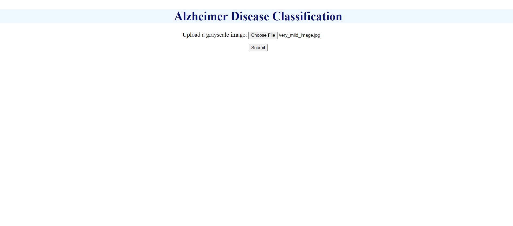
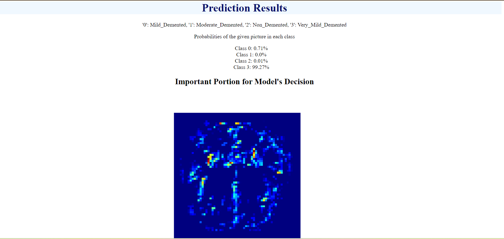

# Alzheimer Disease Classification Web App

This web application classifies Alzheimer's disease using a Convolutional Neural Network (CNN) built with PyTorch. It allows users to upload MRI images and provides predictions and Grad-CAM visualizations for interpretability.

## Demo
  

## Features
- Upload an MRI image for classification.
- Provides probability scores for four classes of Alzheimer's disease.
- Generates a Grad-CAM visualization to explain the model's predictions.
- User-friendly interface for easy interaction.

## Technologies Used
- **Frontend**: HTML, CSS (rendered using Flask's Jinja2 templates)
- **Backend**: Python, Flask
- **Machine Learning Framework**: PyTorch
- **Image Processing**: PIL (Python Imaging Library)
- **Visualization**: Matplotlib
- **Libraries**:
  - Numpy for numerical operations
  - Torch for deep learning
  - torchvision for image transformations

## Getting Started
To get a local copy of the project up and running, clone the repository using `git clone https://github.com/ssali07/AlzheimerDiseaseClassifiaction.git`, navigate into the project directory with `cd AlzheimerDiseaseClassifiaction`, ensure you have the trained model file (`model.pth`) placed in the project directory, install the required Python libraries using `pip install -r requirements.txt`, and run the Flask application with `python app.py`. Open your web browser and navigate to `http://127.0.0.1:5000/` to access the application.

## Usage
1. Upload an MRI image using the provided interface.
2. Click the "Submit" button to analyze the image.
3. View the predicted probabilities and Grad-CAM visualizations for your uploaded image.

## Future Enhancements
- Expand the dataset used for training to include more diverse cases.
- Deploy the app to a cloud platform for broader accessibility.

## Contributing
Contributions are welcome! If you'd like to contribute, please follow these steps:
1. Fork the repository.
2. Create your feature branch (`git checkout -b feature/AmazingFeature`).
3. Commit your changes (`git commit -m 'Add some AmazingFeature'`).
4. Push to the branch (`git push origin feature/AmazingFeature`).
5. Open a pull request.

